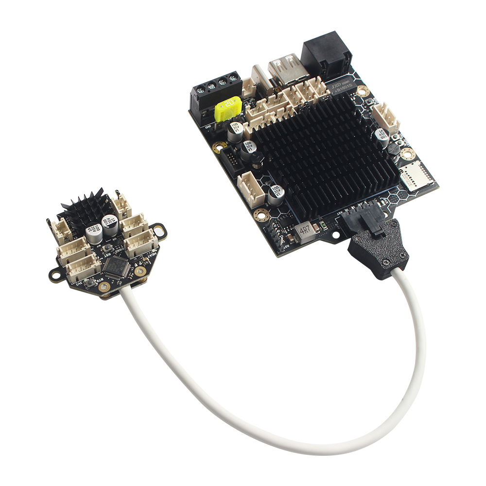

# 1.Introduction
The Bull Ant control board kit is an entry-level control board specially designed for Klipper firmware, making it possible to realize the application of Klipper single nozzle at an extremely low price. It is designed with simplicity and ease of use as its core, dual-core A53 controller as the core, dual RP2040 MCU as signal input and output controller, including silent driver, print head split control board, direct cascading through USB, simple, fast and stable.
# 2. Features
- Dual-Core Cortex-A53 ARM CPU
- RP2040 MCU
- Mainboard + ToolHead Board  Mode
- 100M Ethernet
- 2.4G WiFi
- TMC2209 + GC6609
- RGB Support
- 12864 Display Panel Support
- Dwin Touch Screen Support（To Be Done）
# 3. Firmware and OS
  The main control board uses RP2040 as the MCU, the tool head uses STM32F072 as the MCU (refer to [M36](https://github.com/FYSETC/M36_HUB_V1) for details), and the host computer uses Allwinner R329 as the CPU.
  If you are a developer and are very familiar with Linux, the R329 Armbian SDK is here for reference: https://github.com/eliwong/armbian-build/tree/r329-wip,For more detailed operations, please refer [here](https://wiki.sipeed.com/soft/Lichee/zh/MaixSense/contribution/Build_R329.html)
  Bullant's Armbian system comes from sipeed's MaixSense. You can also refer to the detailed information provided by their wiki: https://wiki.sipeed.com/hardware/en/maixII/M2A/flash_system.html

  We also provide image files with klipper installed and voron v0 configured. You only need an 8GB+ TF card to burn and use. Located at: https://github.com/FYSETC/FYSETC_Bullant_V1.0/blob/main/software/Bullant_Armbian_OS_Klipper_Build_in_V1.0.rar
  

## How to prepare a SD card?
Extract your downloaded image file to get the .img file, run Etcher, click Flash from the file, choose the extracted .img file, click Select target and choose your sdcard, click Flash to burn your sdcard, wait it for finishing.

If failed burning, try to format your SD card. For Windows and macOS users we suggest using SD Card Formatter to format sdcard, while for Linux users can try Gparted.

## How to boot?
Insert SD card into a slot and power the board. (First) boot (with DHCP) takes up to two minutes with a class 10 SD card and cheapest board.

## How to login?

Via the serial port

On the Bullant, there is a USB-C interface, which is connected to the serial port of the R329 through the CH340, and its baud rate is 115200.

Make sure your computer has the CH340 driver installed, and connect the bullant to your PC using a USBA-C data cable.

You can then use SSH software like Xshell, mobaxterm, putty, etc. to communicate with Bullant.

Default username: bullant

Default password: armbian

root password: armbian

After logging in, you can manage the network connection by using the nmtui command, and you can connect SSH over the network next time.you can also note down the bullant's IP address in order to access the klipper web page.

Once connected to the Internet, you can also directly access the klipper web page provided by Bullant using “bullant.local”
   
